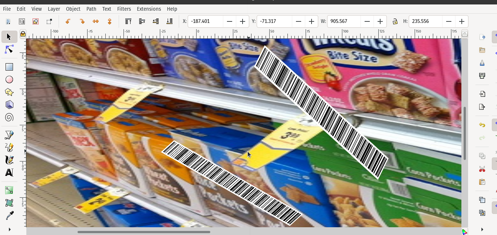
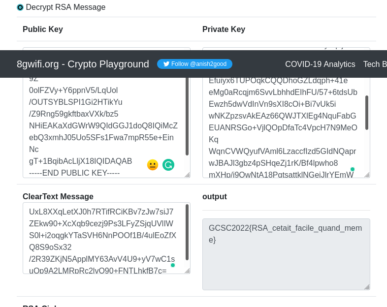
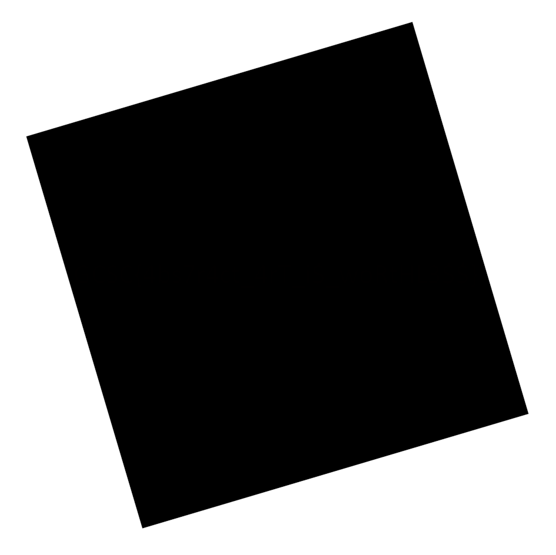
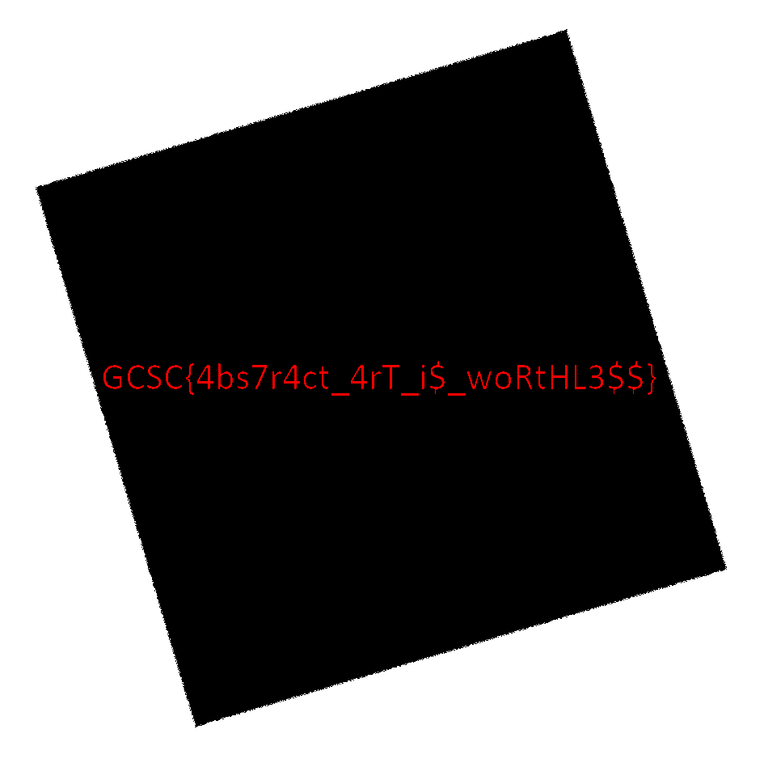

# Finding vulnerability for guinean cybertaskforce ctf
Hi , my name is abdoul i am from guinea , i live in the beautiful city called labé  

### Getting started

after i saw a post in twitter that guinean-cybertaskforce.com will organize a ctf challenge , i was so exited to to participate
then i decide to signup and wait for the challenge

### The Game begin

i receive  my credential for the ctf challenge    at Feb 19, 2022, 8:13 PM , then i wait until  Feb 20, 2022, 1:00 AM to begin the
ctf challenge 

here the the challenge that i was able to solve  ,not by order

#### capture_madagascar-Acces au serveur discord!
N'oublie pas d'accéder au serveur Discord!

Flag : GCSC2022{lien_serveur_discord}

link: https://discord.gg/3gvtd8N6

#### solution

i copied the discord link  then replaced the lien_serveur_discord in the flag

GCSC2022{https://discord.gg/3gvtd8N6}

### Capture-canada IP_publique x Collaborer x Interagir

Houhou!

On te présente ce formulaire du site web en cours de construction.

Interagit avec le serveur de la CyberBadCorp et trouve-lui un usage non sollicité.

Indice: -5 points

Flag: GCSC2022{flag_ici}

link: http://challenges.guinean-cybertaskforce.com:5000/

link2: https://www.youtube.com/watch?v=5F_32HwJFDg

#### solution

the link 1  http://challenges.guinean-cybertaskforce.com:5000/ was for the ctf challenge and second link was the La Fouine - Trois mots
thanks for the second  link too (i like la fouine)

when i opened the link 1  http://challenges.guinean-cybertaskforce.com:5000/  , i have found that the page has a form  for registration
the first thing that came in my mind  was to try for  sqli  , but i abandoned that idea  the  and  filed all field 

as you seen in the image above , my idea was to add a long text in all the field  to got an error , and i did that  then i got an error requests.exceptions.ConnectionError

in the first error line , you'll see the flag  GCSC%7BUt1llisseZ_t0ujoUr$_c0ll4boRat0R%7D

just  url decode the  flag  and replace  GCSC to  GCSC2022

the valide valide flag was GCSC2022{Ut1llisseZ_t0ujoUr$_c0ll4boRat0R}

it seen that debug mode was enable  , from my point of view it  give back the error when url take  too long time to connect

### Capture_south-africa - AU super marché

Tu fais de la filature depuis plusieurs semaines sur un membre actif de la CyberBadCorp.

Tous les jours, il se rend dans cette même enseigne pour faire ses courses. 

Tu as remarqué qu'il prend assez de temps dans le rayon des céréales.

Pointilleux sur les détails, tu décides de prendre une séquence photos des produits de ce rayon pour les analyser.

Sans surprise, tu trouves que cette image est un peu particulière à vue d’œil. 

Arriveras-tu à trouver des informations qui feront avancer ta mission?

Flag: GCSC2022{flag_ici}

link: https://drive.google.com/file/d/1mvDSKrvHt26G4rsqmiRO25_om3pjH2RL/view?usp=sharing

#### solution

when i opened the  google driver link , i have found that it was an svg image , called cereals.svg
then first can  thing that came to my mind was to zoom the image as  to see if i can find the  flag , but i was totally wrong
after a few minute of testing different technique like  like  exiftool cereals.svg , i found nothing useful
after litle bit of break  , i got the idea to  edit the image using an  editor of text , me i used vim for that

after editing the image using vim cereals.svg  , i have found in  the  second  that the image image was created using Inkscape

<-- Created with Inkscape (http://www.inkscape.org/) -->
as it seen that the image was created using Inkscape , i decide to install Inkscape in my computer
after installing  Inkscape ,  i opened the cereals.svg  image with Inkscape then   i found a weired barcode  , i clicked in the barcode  and  zoomed the barcode

the image looked like this 

i have installed a barcode scanner in my android , then i scanned  it to find the  flag

i used this flag to validate the challenge : GCSC{baR_c0d3$_oR_J4lL_b4rZ}

### Capture-chad Clé de déchiffrement ou décryptage?

Mon Dieu! Le pire est arrivé.

Déterminé à faire tomber la CyberBadCorp, à tout prix, tu as malencontreusement cliqué sur un lien laissé exprès dans le téléphone que tu as analysé. 

Cela a crypté uniquement ton rapport d’avancement sur ladite mission.

Retrouve vite la clef de déchiffrement et continue a les traquer.

Flag: GCSC2022{flag_ici}

link: https://drive.google.com/file/d/1QGIrPRp-vLr8W2vQsJfGCHiWJ58tFWQJ/view?usp=sharing

#### solution
it was my first time to touch  cryptanalysis  related  ctf 

when i  opened the google driver link https://drive.google.com/file/d/1QGIrPRp-vLr8W2vQsJfGCHiWJ58tFWQJ/view?usp=sharing ; i have found that it was  a zip  file that  has a note.txt 
the first thing  come to my mind was to donwload the  note.zip to see  if i can access to note.txt
after downloading the zip file , i tried to extract the file   but i got popup  that password was required

I asked myself  how i can extract the zip file that require password , something that i dont know
my best friend here was  google , after long hour searching  tools , reading write-up related to cracking zip file  and technique to crack the zip 
i have found a tools  called fcrackzip   and rockyou.txt wordlist

now its time to crack the file 
full cmd : fcrackzip -b -D -p /home/abdulsec/wordlist/rockyou.txt -u ./note.zip
after two munite , we have the password : Catsandcows

now , i was able the  extract the zip file using the password :  Catsandcows
as i use linux , i used only cat note.txt  to got the flag  GCSC{p4$sw0rD_cr4ck1nG_br34kZ_GPUs}
now you have just to replace GCSC to GCSC2022

the final flag was:  GCSC{p4$sw0rD_cr4ck1nG_br34kZ_GPUs}

### Capture-United-states iles vivent avec le rsa en france
On te donne le crytosystème utilisé : message, clé privée et clé publique.

Indice: -5 points
Flag: GCSC2022{flag_ici}

link: https://drive.google.com/drive/folders/1p9aQ2-PMoY5yXjqQLj83CH-JDXV1qvgR?usp=sharing
#### solution 

when i  clicked in the google driver  link https://drive.google.com/drive/folders/1p9aQ2-PMoY5yXjqQLj83CH-JDXV1qvgR?usp=sharing , 
i have found a folder called RSA  that has 
three files  cl3_publique.txt  cl3_priv3e.txt message_chiffr3.txt
after a few minute googling , i found this web site https://8gwifi.org/rsafunctions.jsp
i copied cl3_publique.txt text and i pasted it in Public Key field
i copied cl3_priv3e.txt text and i pasted it in private key field
i copied message_chiffr3.txt and i pasted it ClearText Message field

in the output i got the flag GCSC2022{RSA_cetait_facile_quand_meme} an i used that flag to validate the challenge

### Capture-cameroon Voler des informations avec classe. Quel art !

Cette nuit encore, un nouvel incident de sécurité s'est produit du côté de la préfecture de Kankan.

Apres avoir eu un accès au SI, le malveillant tente d'exfiltrer des informations par l'envoi d'une image d'apparence anodine.

Il semble que c'est la technique utilisée par la CyberBadCorp avant que tu ne rejoignes le rang des cybercombattants guinéens.

Analyse attentivement cette image et trouve l'information exfiltrée.

Flag: GCSC2022{flag_ici}

link: https://drive.google.com/file/d/1RhUenex0V-_OFWJ8nJzUUB6QDEIUfIn9/view?usp=sharing

#### solution
when i opened the google driver link , i have found this  image

now its time  google  to learn more about steganalysis
after few munites of googling , i have found this web site  https://aperisolve.fr/

What is this ?

Aperi'Solve is an online platform which performs layer analysis on image. The platform also uses zsteg, steghide, outguess, exiftool, binwalk, foremost and strings for deeper steganography analysis. The platform supports the following images format: .png, .jpg, .gif, .bmp, .jpeg, .jfif, .jpe, .tiff...

after i uploaded the image in  the  platform   , i got a differnt view supperimposed of image 
here the result of on of the image that showed the  flag

i just changed the GCSC from the image  to GCSC2022 to validate the challenge

### Capture-Nigeria Mots de passe d'une application étrange

Les régions minières du pays attirent de plus en plus la CyberBadCorp.

Trois de leurs membres décident de s'installer dans la région de Kamsar afin de dépouiller le plus d'entreprises d'exploitation.

En cours de chemin, ils s'arrêtent un moment dans un village pour manger et se reposer avant de reprendre la route. Ils en profitent aussi pour recharger leurs appareils dans un télécentre.

Le gérant du télécentre, agent secret, dumpe le contenu de leurs téléphones qu'il te transmet à des fins d'analyse pour des questions de sécurité nationale. 

Lors de tes analyses, tu remarques qu'à un moment donné, tous les trois ont utilisé le même téléphone pour se connecter à une application de messagerie instantanée étrange. 

Tu as vite retrouvé la base de données reliée à cette application. Maintenant, trouve leurs mots de passe.

Flag: GCSC2022{Password1_Password2_Password3)

link: https://drive.google.com/file/d/1YL5jgnjy1-w5k9vdIVofSjQy2J9uVjr3/view?usp=sharing

#### solution

when i opened the google driver link https://drive.google.com/file/d/1YL5jgnjy1-w5k9vdIVofSjQy2J9uVjr3/view?usp=sharing
i saw a file that has an extension .db with the name BD application mobile then  i downloaded the  file  locally and i changed the name BD application mobile.db to mobile.db
if you google  the extension .db you will it's  a sqlite database

if you dont have sqlite in your computer then  , install  it

to use the db type in your computer the following cmd 
sqlite3 mobile.db
SQLite version 3.35.5 2021-04-19 18:32:05
Enter ".help" for usage hints.
sqlite> .database
main: /home/abdulsec/labs/ctf/mobile.db r/w
sqlite> .tables
users
sqlite> select * from users
   ...> ;
John|ODI3MDQ0MGMwZTk0MTExZDExZmFmMzg1MTI1Nzc4ZTc= 
Marie|NDFkNTM4YTcxYjJhYTYwMDRkNTM0MjM3NzEwNDFjOWMK  

Luc|NGVmY2RhYzg1YzZjNDk0YjNjZWY4NzgxY2M2Mzk4MDUK    

sqlite> 
now you have user with base64 encoded password
its time to decode the password

when you decode the password ODI3MDQ0MGMwZTk0MTExZDExZmFmMzg1MTI1Nzc4ZTc=  of John you got this 8270440c0e94111d11faf385125778e7
when you decode the password of NDFkNTM4YTcxYjJhYTYwMDRkNTM0MjM3NzEwNDFjOWMK  Marie you got this 41d538a71b2aa6004d53423771041c9c
when you decode the password of NGVmY2RhYzg1YzZjNDk0YjNjZWY4NzgxY2M2Mzk4MDUK Luc you got this  4efcdac85c6c494b3cef8781cc639805

now we got md5 password hash , we need again to crack the password to got the plain text password

after a few minutes of googling  , i found this  free website  https://crackstation.net/ for password hash cracking

after  cracking  John md5 password i got this :  p1ntap
after  cracking  Marie md5 password i got this :  fd1972
after  cracking  Luc md5 password i got this :   AdDiCtIoN

now we have 

user   password

John | p1ntap
Marie| fd1972
Luc  | AdDiCtIoN

now i have to use the three password to validate the challenge

the final flag are GCSC2022{p1ntap_fd1972_AdDiCtIoN)

