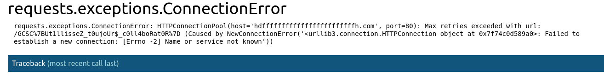
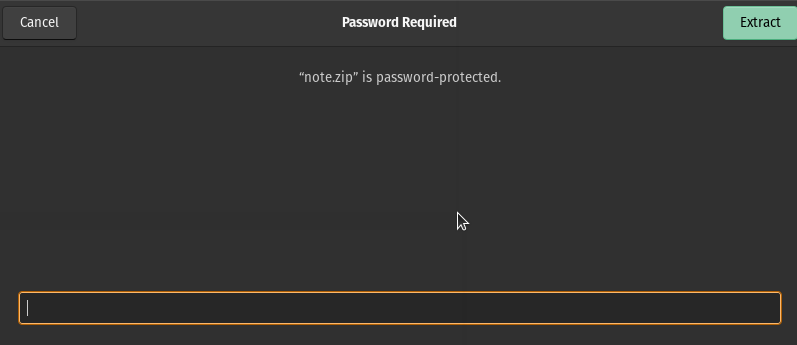
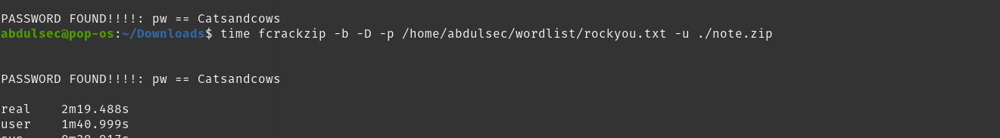

# Finding vulnerability for guinean cybertaskforce ctf
Hi , my name is abdoul i am from guinea , i live in the beautiful city called labé  

### Getting started

after i saw a post in twitter that guinean-cybertaskforce.com will organize a ctf challenge , i was so exited to to participate
then i decide to signup and wait for the challenge

### The Game begin

i receive  my credential for the ctf challenge    at Feb 19, 2022, 8:13 PM , then i wait until  Feb 20, 2022, 1:00 AM to begin the
ctf challenge 

here the the challenge that i was able to solve  ,not by order

#### capture_madagascar-Acces au serveur discord!
N'oublie pas d'accéder au serveur Discord!

Flag : GCSC2022{lien_serveur_discord}

link: https://discord.gg/3gvtd8N6

#### solution

i copied the discord link  then replaced the lien_serveur_discord in the flag

GCSC2022{https://discord.gg/3gvtd8N6}

### Capture-canada IP_publique x Collaborer x Interagir

Houhou!

On te présente ce formulaire du site web en cours de construction.

Interagit avec le serveur de la CyberBadCorp et trouve-lui un usage non sollicité.

Indice: -5 points

Flag: GCSC2022{flag_ici}

link: http://challenges.guinean-cybertaskforce.com:5000/

link2: https://www.youtube.com/watch?v=5F_32HwJFDg

#### solution

the link 1  http://challenges.guinean-cybertaskforce.com:5000/ was for the ctf challenge and second link was the La Fouine - Trois mots
thanks for the second  link too (i like la fouine)

when i opened the link 1  http://challenges.guinean-cybertaskforce.com:5000/  , i have found that the page has a form  for registration
the first thing that came in my mind  was to try for  sqli  , but i abandoned that idea  the  and  filed all field 

as you seen in the image above , my idea was to add a long text in all the field  to got an error , and i did that  then i got an error requests.exceptions.ConnectionError

in the first error line , you'll see the flag  GCSC%7BUt1llisseZ_t0ujoUr$_c0ll4boRat0R%7D

just  url decode the  flag  and replace  GCSC to  GCSC2022

the valide valide flag was GCSC2022{Ut1llisseZ_t0ujoUr$_c0ll4boRat0R}

it seen that debug mode was enable  , from my point of view it  give back the error when url take  too long time to connect

### Capture_south-africa - AU super marché

Tu fais de la filature depuis plusieurs semaines sur un membre actif de la CyberBadCorp.

Tous les jours, il se rend dans cette même enseigne pour faire ses courses. 

Tu as remarqué qu'il prend assez de temps dans le rayon des céréales.

Pointilleux sur les détails, tu décides de prendre une séquence photos des produits de ce rayon pour les analyser.

Sans surprise, tu trouves que cette image est un peu particulière à vue d’œil. 

Arriveras-tu à trouver des informations qui feront avancer ta mission?

Flag: GCSC2022{flag_ici}

#### solution

### Capture-chad Clé de déchiffrement ou décryptage?

Mon Dieu! Le pire est arrivé.

Déterminé à faire tomber la CyberBadCorp, à tout prix, tu as malencontreusement cliqué sur un lien laissé exprès dans le téléphone que tu as analysé. 

Cela a crypté uniquement ton rapport d’avancement sur ladite mission.

Retrouve vite la clef de déchiffrement et continue a les traquer.

Flag: GCSC2022{flag_ici}

link: https://drive.google.com/file/d/1QGIrPRp-vLr8W2vQsJfGCHiWJ58tFWQJ/view?usp=sharing

#### solution
it was my first time to touch  cryptanalysis  related  ctf 

when i  opened the google driver link https://drive.google.com/file/d/1QGIrPRp-vLr8W2vQsJfGCHiWJ58tFWQJ/view?usp=sharing ; i have found that it was  a zip  file that  has a note.txt 
the first thing  come to my mind was to donwload the  note.zip to see  if i can access to note.txt
after downloading the zip file , i tried to extract the file   but i got popup  that password was required

I asked myself  how i can extract the zip file that require password , something that i dont know
my best friend here was  google , after long hour searching  tools , reading write-up related to cracking zip file  and technique to crack the zip 
i have found a tools  called fcrackzip   and rockyou.txt wordlist

now its time to crack the file 
full cmd : fcrackzip -b -D -p /home/abdulsec/wordlist/rockyou.txt -u ./note.zip
after two munite , we have the password : Catsandcows

now , i was able the  extract the zip file using the password :  Catsandcows
as i use linux , i used only cat note.txt  to got the flag  GCSC{p4$sw0rD_cr4ck1nG_br34kZ_GPUs}
now you have just to replace GCSC to GCSC2022

the final flag was:  GCSC{p4$sw0rD_cr4ck1nG_br34kZ_GPUs}
